# X-BUNDLE: Platform Kolaborasi Produk UMKM

## 1. Informasi Kelompok

| Status | Nama Anggota | NIM |
| :--- | :--- | :--- |
| Ketua | **Sultan Bani Hakim** | 2315061103 |
| Anggota | Arlen Destico | 2315061120 |
| Anggota | Agustina Putri | 2315061129 |
| Anggota | Fayiz Akbar Daifullah | 2315061011 |

***

## 2. Judul & Ringkasan Proyek

**Judul Proyek:** **X-BUNDLE**

**Ringkasan Proyek:**
X-BUNDLE adalah platform manajemen kemitraan digital yang dirancang untuk Usaha Mikro, Kecil, dan Menengah (UMKM) untuk memfasilitasi kolaborasi produk (bundling). Aplikasi ini bertujuan untuk mendorong Transformasi Digital bagi UMKM dengan fitur-fitur utama sebagai berikut:
* **User Management** (Login, Registrasi, Profil, Role Admin, Mitra UMKM, Umum).
* **Manajemen Produk** (CRUD) untuk setiap UMKM.
* **Fitur Transaksi/Layanan**: Fitur utama adalah membuat dan mengelola *Bundle Deals* (kesepakatan produk gabungan) antar UMKM.
* **Komunikasi & Persetujuan**: Dilengkapi dengan fitur *Chat Room* untuk diskusi kesepakatan.
* **Sistem Voucher**: Pembuatan dan validasi kode voucher untuk promosi bundle yang disepakati.
* **Pelaporan** data pengguna dan voucher.

***

## 3. Cara Menjalankan Aplikasi

Aplikasi ini dibangun menggunakan PHP Native sebagai Backend, HTML5, CSS3, dan JavaScript Native sebagai Frontend, serta MySQL sebagai Database.

### Persyaratan
1.  Web Server Lokal (Laragon)
2.  PHP 
3.  MySQL/MariaDB

### Langkah Instalasi

1.  **Penempatan Berkas:**
    * Pindahkan seluruh folder `kelompok_18/` ke dalam direktori web server.

2.  **Konfigurasi Database:**
    * Buka *tool* manajemen database (phpMyAdmin).
    * Buat database baru dengan nama: `db_xbundle`.
    * Import file `db_xbundle.sql` yang tersedia di dalam folder `src/` ke database `db_xbundle` yang baru dibuat.

3.  **Konfigurasi Koneksi (Opsional - Jika menggunakan setelan default):**
    * Cek file `src/config/koneksi.php`. Setelan default adalah:
        ```php
        $hostname = "localhost";
        $username = "root";
        $password = ""; 
        $database = "db_xbundle"; 
        $base_url = "http://localhost/TUBES_PRK_PEMWEB_2025/kelompok/kelompok_18/src/";
        ```
    * Jika pengaturan database berbeda dari default (misalnya menggunakan password), harap sesuaikan `$username` dan `$password` di file tersebut.

4.  **Akses Aplikasi:**
    * Buka browser dan akses URL:
        `http://localhost/TUBES_PRK_PEMWEB_2025/kelompok/kelompok_18/src/`

### Akun Uji Coba (Default)

| Role | Email | Password |
| :--- | :--- | :--- |
| **Admin** | `admin@xbundle.com` | `admin123` (Password di-hash bcrypt)
| **UMKM** | `bani@kopi.com` | `123456` (Password di-hash bcrypt)
| **UMKM** | `bani@roti.com` | `123456` (Password di-hash bcrypt)


## Tampilan Website ##

## Administrasi ##
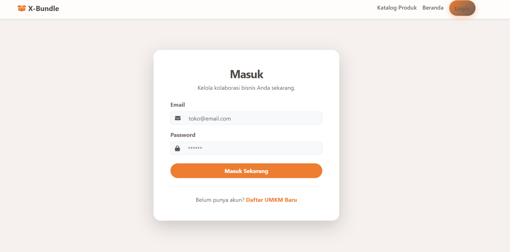
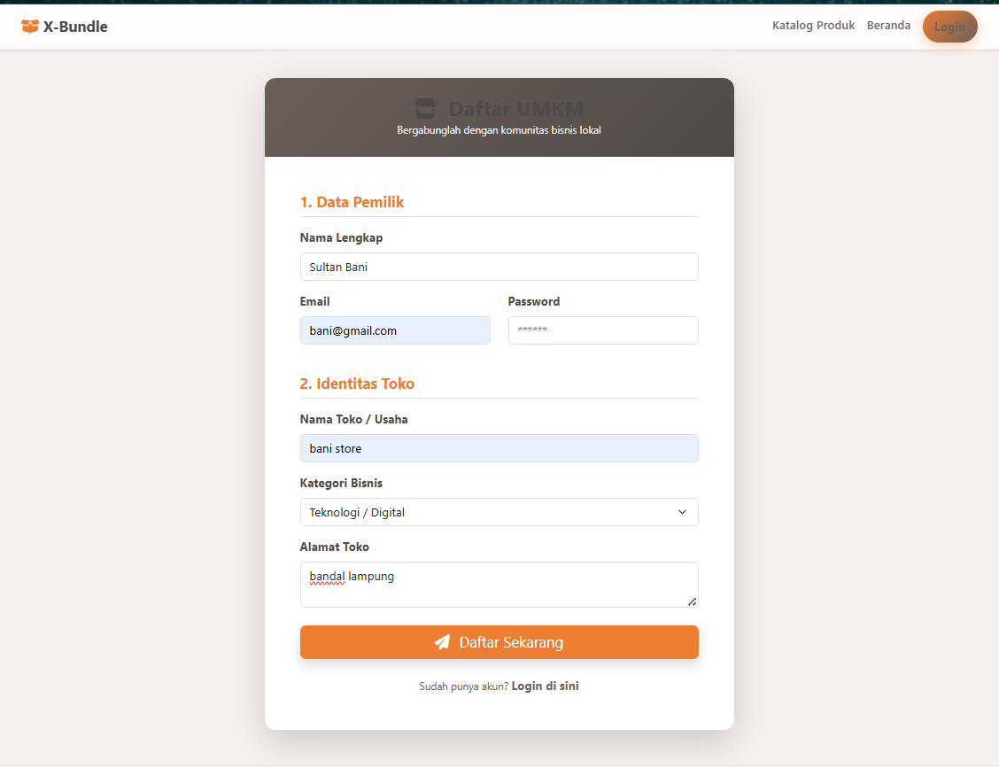


### Role Umum ###


## Role Admin ##
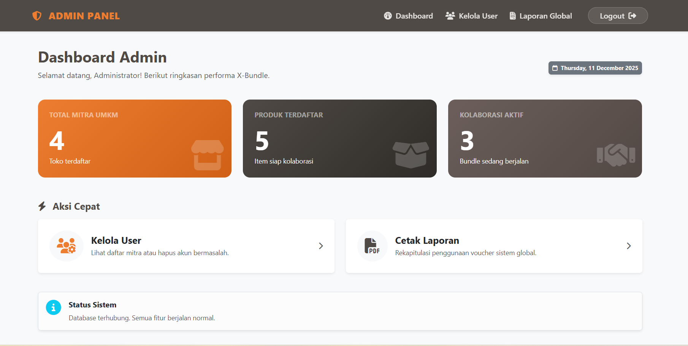
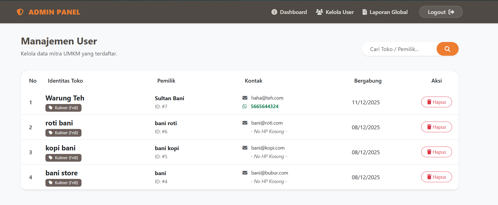
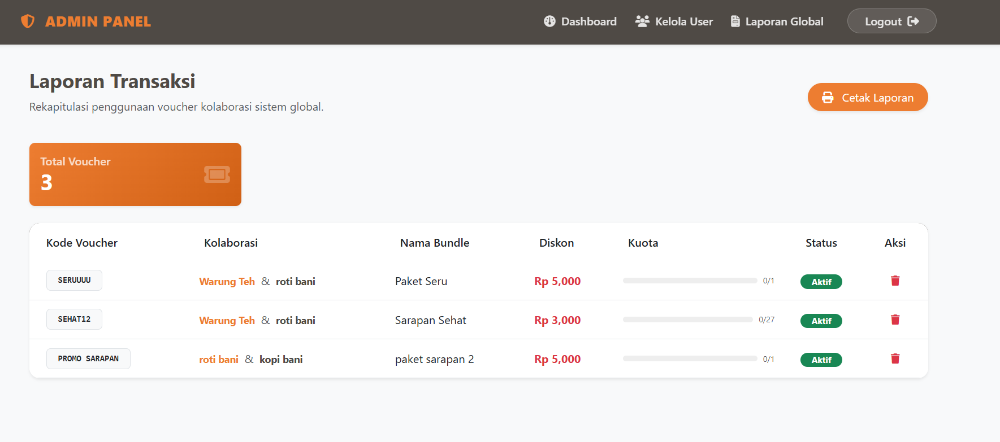
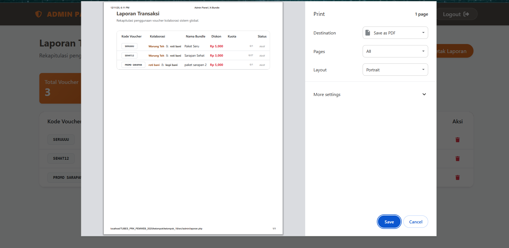


## Role Mitra UMKM ##
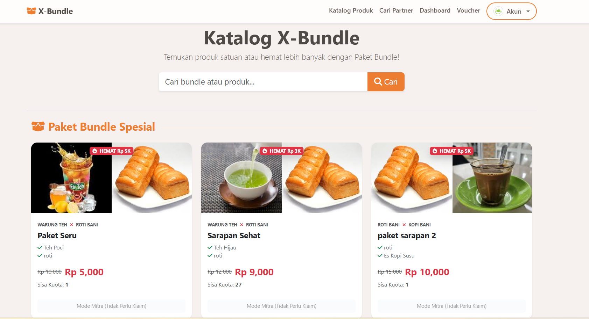
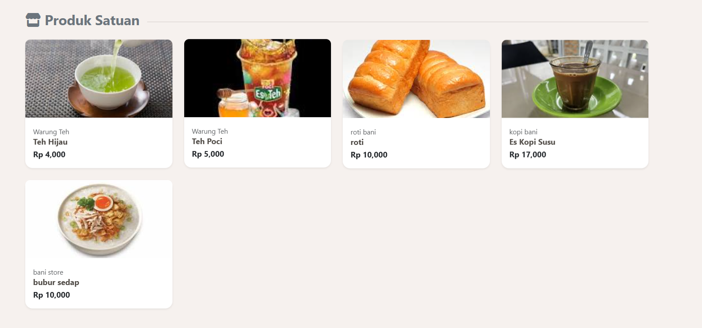
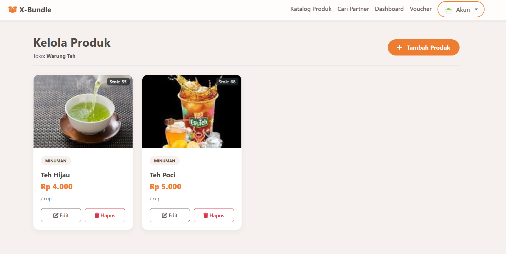
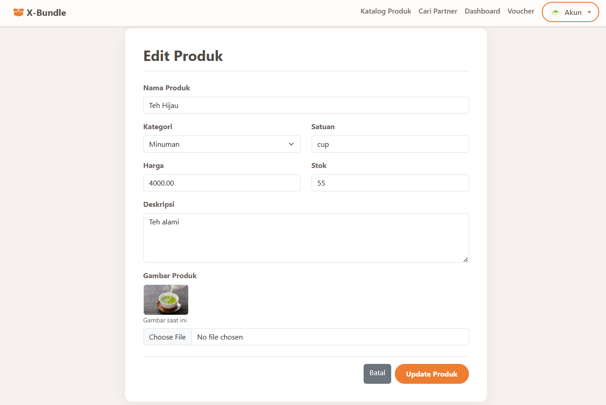
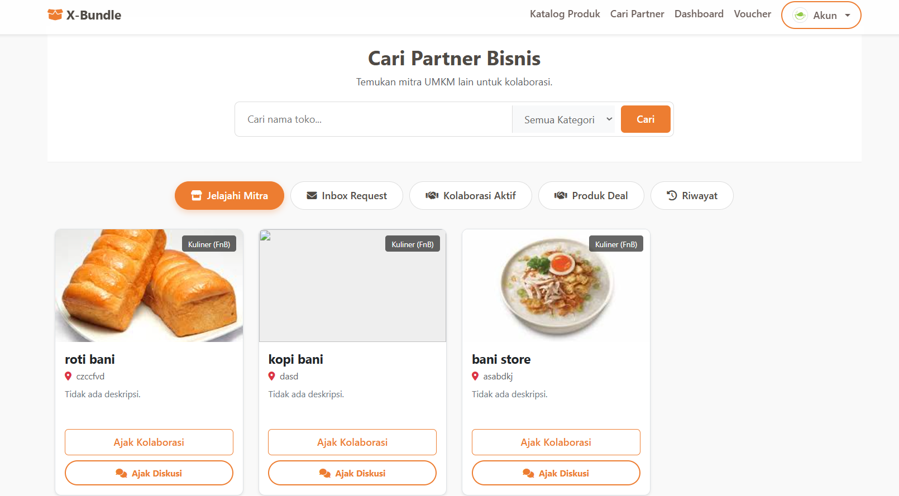

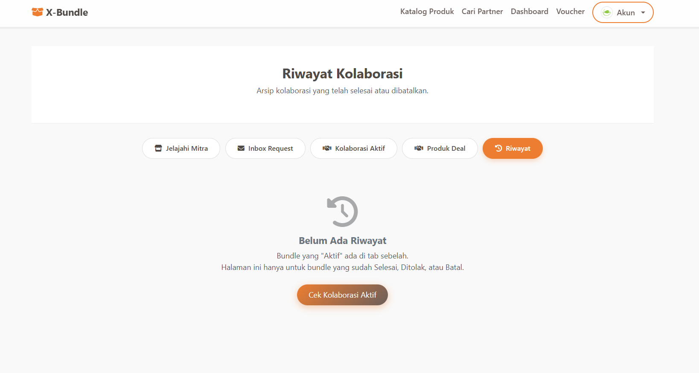
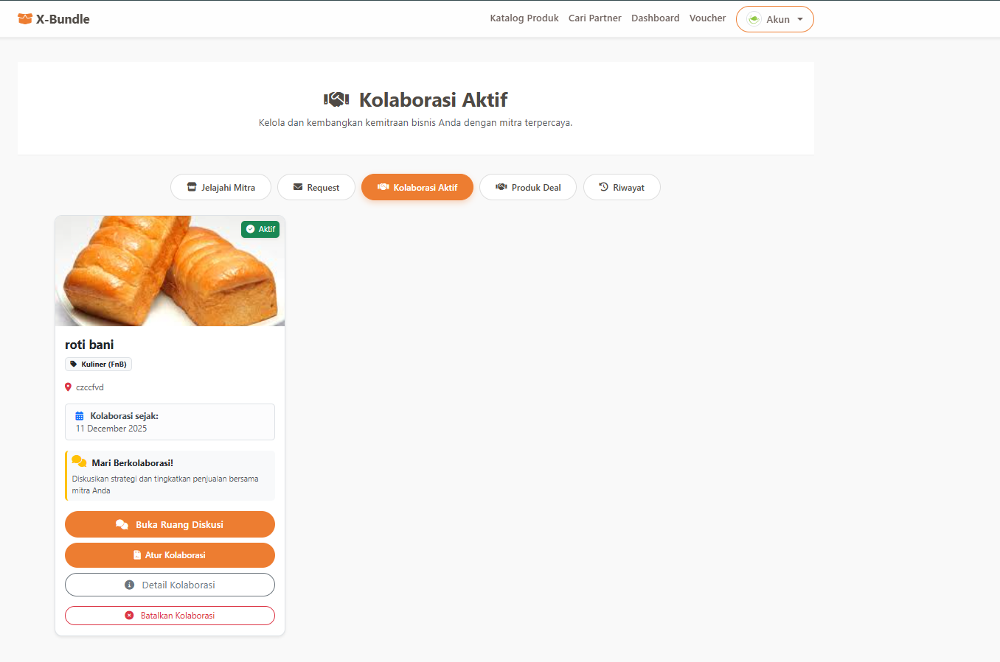
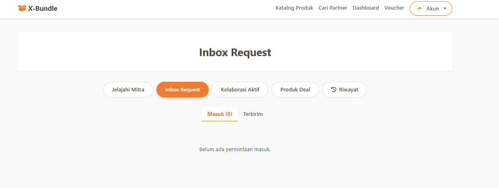
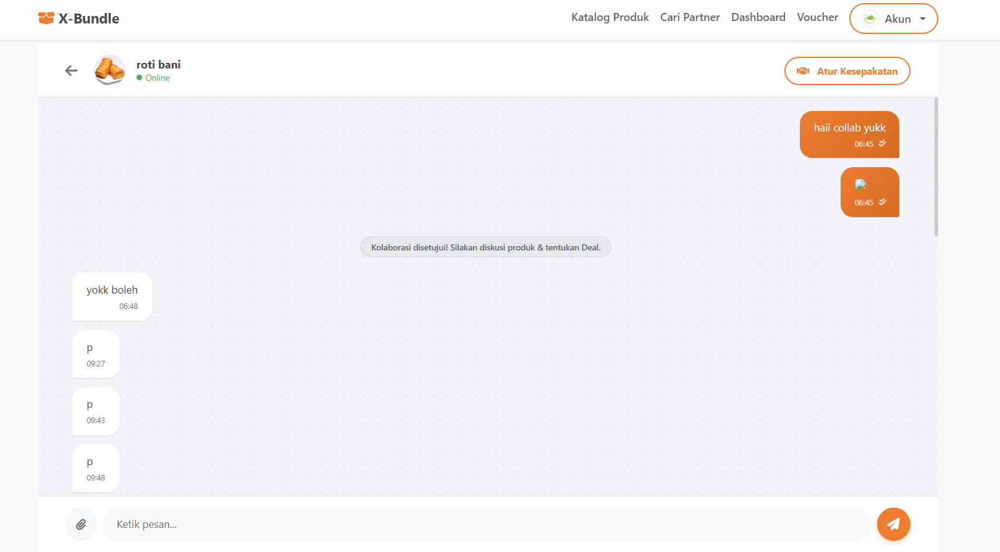
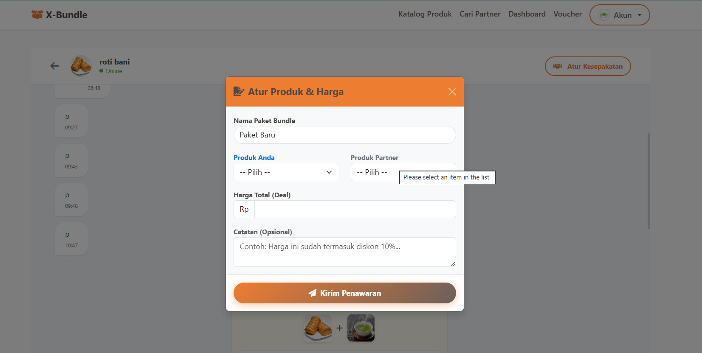
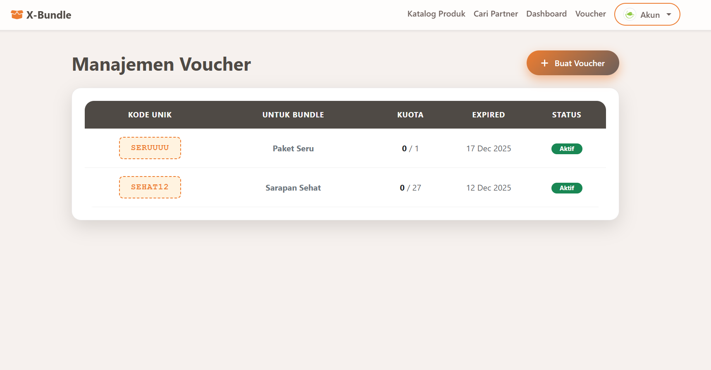

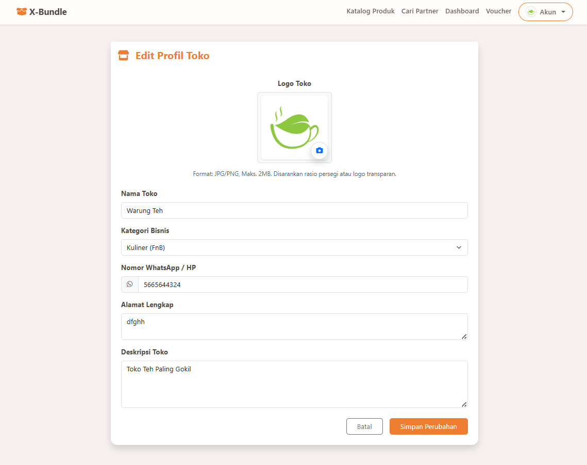


